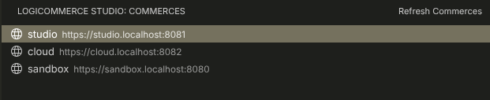
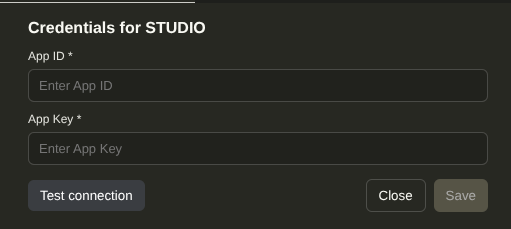

# LogiCommerce frontoffice-dev

This repository contains the base Dev Container template used for LogiCommerce headless front-office projects.

The recommended way to work with this template now is to use the **Logicommerce Studio** VS Code extension, which automates the setup and daily workflow. Manual setup is still possible and is documented in [this separate guide](FRONTDEV.md).

---

## Recommended: Logicommerce Studio extension

**Logicommerce Studio**  
Work with LogiCommerce headless front-office projects in a local Dev Container environment, reusing the same structure and workflows as the official LogiCommerce front-office template.

This extension automates the common workflow for LogiCommerce front-office development:

- Quickly initialize a local Dev Container environment.
- Add, manage, and switch between multiple commerce projects with ease.
- Access convenient helper commands both inside and outside the Dev Container.
- Effortlessly open your local commerce, copy its URL, and edit configuration settings as needed.



### Requirements

- Docker installed and running.  
- Visual Studio Code with:
  - Dev Containers extension (formerly Remote - Containers).

There is no mandatory project structure required to start using this extension.  
You can start from an empty folder and let the extension create what it needs.

### How to use it

1. Install the **Logicommerce Studio** extension from the VS Code Marketplace.  
2. Open a folder you want to use as your LogiCommerce workspace.  
3. Run the Logicommerce Studio commands from the Command Palette:
   - Initialize the workspace and Dev Container.
   - Add or select a commerce.
   - Open the Dev Container and start working on the front-office.

The extension will create and manage the necessary structure and configuration files for you, including the Dev Container definition.

---

#### Compatibility with `frontoffice-dev`

This extension is fully compatible with the public `frontoffice-dev` template if you follow that model:

- Repository: [`logicommerce/frontoffice-dev`](https://github.com/logicommerce/frontoffice-dev)

If your project has been created following the `frontoffice-dev` structure, Logicommerce Studio will detect and reuse it and will keep the `www` symlink and core assets pointing to the correct locations.

If you reuse your old workspace:

##### On Host

- If you manage the lc folder manually, clone the latest versions of the SDK, framework, and PHP plugin from GitHub to keep it up to date.
- Add the extension to your `devcontainer.json`.

```jsonc
"customizations": {
  "vscode": {
    "extensions": [
      ...
      "logicommerce.logicommerce-studio-extension"
    ]
  }
}
```

##### Inside Dev Container

- If you want to use the panel to configure connections, delete your local `config.php` file and reconfigure it.  
  You only need the credentials to access your commerce.

  
  
---